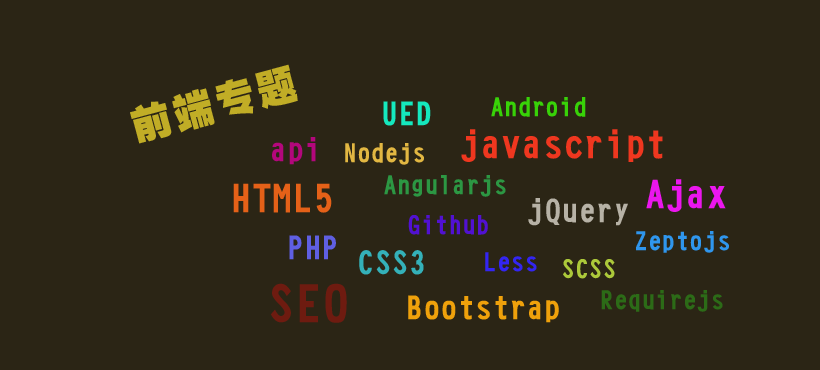

# awesome-fed-learning-resource

> 前端日常学习, 工作资源汇总

## 更新日志

## 目录

## 入门类

## HTML 5 专题

## CSS 3 专题

## JavaScript 专题

## CSS 处理器

### Less

### Stylus

### Sass

## JavaScript 类库/框架

### jQuery

### React

### Vue

### Angular

## 移动端

### Web

### Native

## 大前端

### Node JS

## 兼容性 && 性能优化

## 网络 && 安全

## 测试

## 前端开发规范

## 前端工具

### 开发工具

### 调试工具

### 构建工具

## 技术博客

### 个人维护

### 团队维护

## GitHub值得关注的开源前端项目

## 前端经典书籍

## 求职面试
